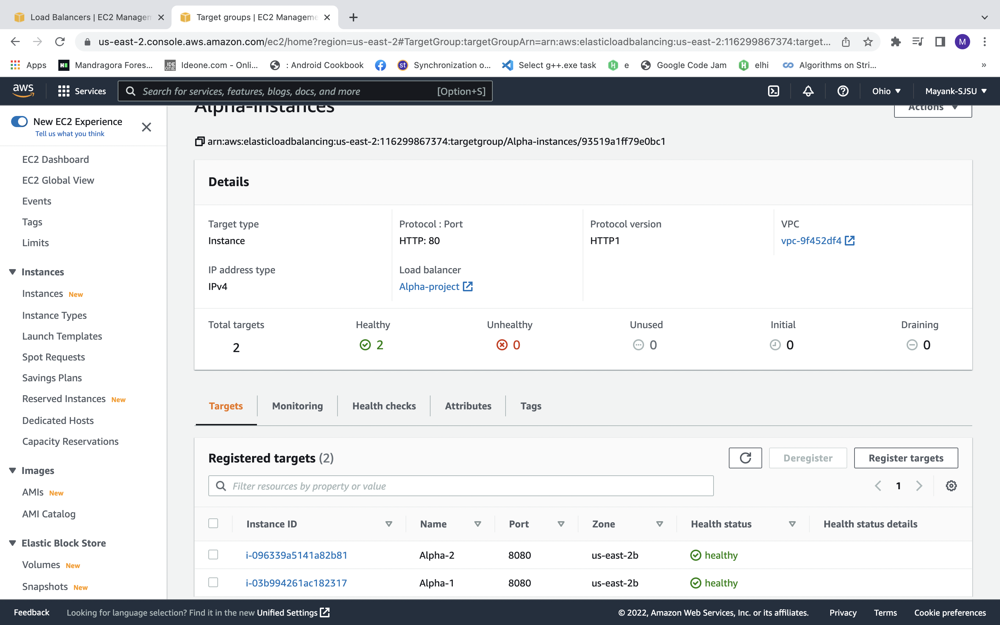
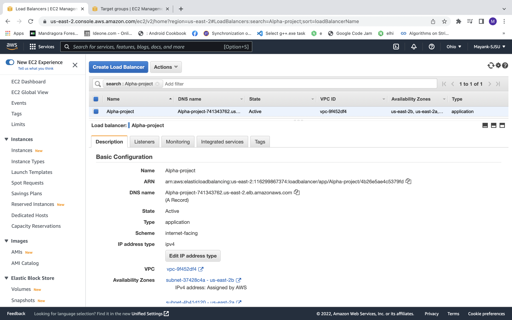
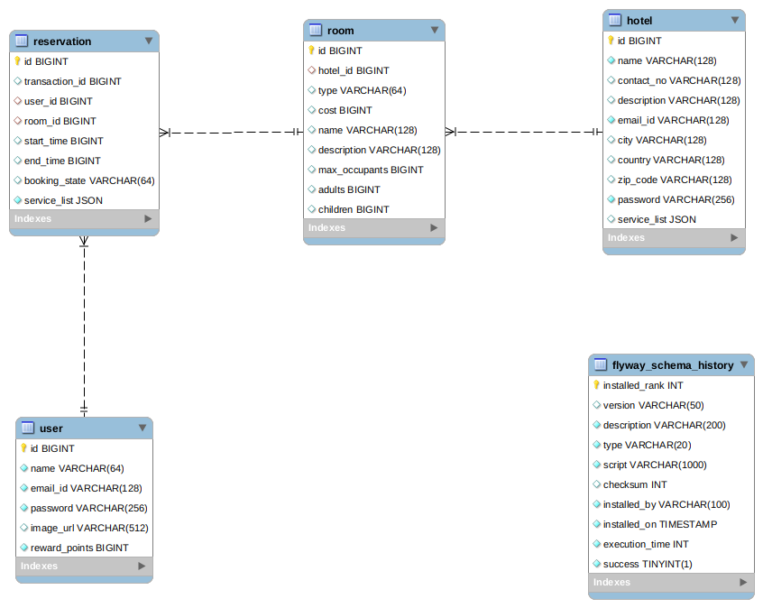
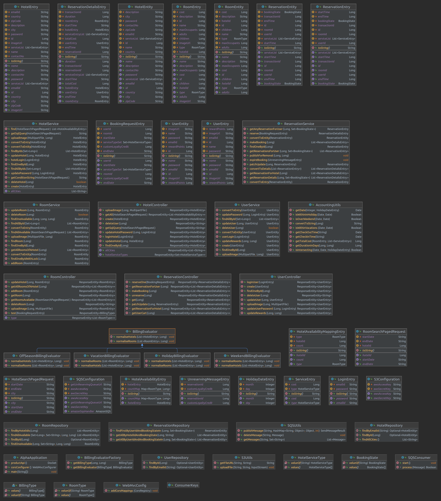

# Hotel Management System by Team - Alpha
 ## Team members/Contributors:
 * Mayank Verma
 * Suharsh
 * Akshay Kulkarni
 * Vivek Joshi

### [Weekly Scrum Journal]()
### [Github Project Board ](https://github.com/gopinathsjsu/team-project-team-alpha/projects/1)
### [Sprint sheet](https://docs.google.com/spreadsheets/d/e/2PACX-1vQWe8Cv1ar0jSaju4RADh7lQBFmoaSXtD7EF6JPewRy8k303tp6wPWq_1L9wU2nQY21WzkP0XSqQzZA/pubhtml?gid=0&single=true)
### [Burndown Chart](https://docs.google.com/spreadsheets/d/e/2PACX-1vQv3x1ZhJSlKh_xZUVPvglflqmiTZ6clcQEKvitGzYhYj1PO1ehdrowYrClS9QsWV4kvMB7g2wK-EHg/pubhtml)

### Architecture Diagram

### EC2 Deployment with Load Balancer

### Database Design

### Class Diagram

